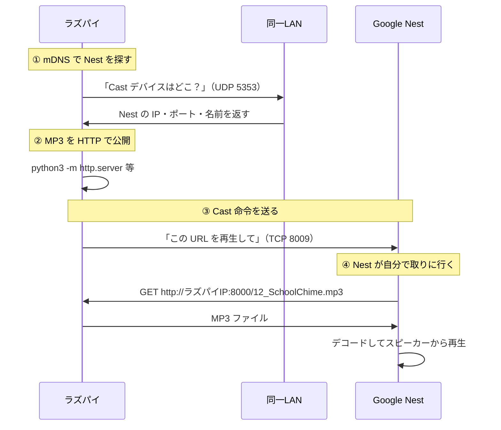

# Google Nest をラズパイで鳴らす

## 第1章　背景・目的

### 背景

海老名（自宅）の **Raspberry Pi 3 Model B Plus** は、現在 **Raspbian 10 (buster) 32bit** が入っている（詳細は参考１）。OS・Python が古く、AI 支援付きの開発環境としては足りない。

### 目的

1. **OS を新規に入れ替える** … クリーンな環境で再スタートする
2. **AI を使って開発する** … コード生成・修正を AI に任せながら進めたい
3. **第一目標：同一 LAN 上の Google Nest に MP3 を鳴らす** … ラズパイから Cast して再生する

---

## 第2章　方針検討

第1章の目的を達成するための選択肢を比較し、方針を決める章。仕組みは第3章、作業手順は第4章以降。

### 2-1. OS の選び方

| 候補 | メリット | デメリット | 判定 |
| --- | --- | --- | --- |
| **現状維持（buster 32bit）** | 入れ替え不要 | Cursor 不可、Python 古い、VS Code も厳しい | ✗ |
| **bookworm 32bit** | Pi 3 B+ 向き、PyChromecast は問題なし | Cursor Remote SSH 不可（armhf） | △ MP3 のみなら可 |
| **bookworm 64bit** | Cursor / VS Code Remote SSH 可 | Pi 3 B+ 1GB でやや重い | **◎ 採用候補** |
| **Home Assistant OS** | スマートホーム向け GUI | VS Code / Cursor 不可、汎用開発向きでない | ✗ |

**方針：** **Raspberry Pi OS 64bit（bookworm）** を **新 SD カード** に Raspberry Pi Imager で書き込む。

### 2-2. 開発環境（IDE）

| 候補 | 使い方 | 判定 |
| --- | --- | --- |
| **Cursor + Remote SSH**（第一希望） | 海老名の Windows PC から `192.168.124.20` に接続。AI 支援しながらラズパイ上のコードを編集 | **◎**（64bit OS 前提） |
| **VS Code + Remote SSH** | 同上。Copilot 等 | ○ 代替 |
| **ラズパイ上で Cursor を直接動かす** | Pi 上に Cursor CLI を入れる | ✗ 非公式・1GB では非現実的 |

**想定ワークフロー：** Windows で Cursor を開く → Remote SSH でラズパイに接続 → AI に聞きながら Python スクリプトを書く・実行する。

### 2-3. MP3 再生の方式

| 候補 | 概要 | 判定 |
| --- | --- | --- |
| **PyChromecast + 簡易 HTTP サーバー** | ラズパイが MP3 を URL 配信 → Google Nest が Cast 再生 | **◎ 第一目標向け** |
| **Home Assistant** | OS 丸ごと差し替えが必要 | ✗ 今回の方針と合わない |
| **gcast 等 CLI** | PyChromecast のラッパー | ○ 動作確認後に検討可 |

**前提：** ラズパイと Google Nest が **同じ Wi-Fi**（`aterm-1c72d7-2p`）上にあること。通信の流れは **第3章**。

### 2-4. SD カード・既存データ

**2026-07-30：新 SD カードを購入。新規入れ替え（上書きではない）。**

| SD | 扱い |
| --- | --- |
| **新 SD**（本日購入） | bookworm 64bit を書き込み、ラズパイに挿して使う |
| **旧 SD**（buster） | ラズパイから外して **そのまま保管**。`stip/stip33` 等が必要になったら旧 SD を差し直して参照 |

- 旧 SD のデータを消す作業は **不要**（新 SD に別途書き込むだけ）
- 旧環境からファイルだけ持ち出したい場合は、入れ替え前に旧 SD のまま USB 読み取り or ネットワーク経由でコピー

### 2-5. 方針まとめ

| 項目 | 決定 |
| --- | --- |
| OS | Raspberry Pi OS **64bit bookworm** |
| SD | **新 SD に書き込み**（旧 SD は保管） |
| IDE | **Cursor** Remote SSH（ダメなら VS Code） |
| MP3 再生 | **PyChromecast** + `python3 -m http.server` |
| 旧環境 | 旧 SD を外して保管（必要時のみ差し直し） |

---

## 第3章　仕組み

ラズパイから Google Nest に MP3 を鳴らすまでの流れ。**音声データそのものはラズパイから Nest へ直接送らない**（後述）。

### 3-1. 全体像



| 役割 | 誰がやるか |
| --- | --- |
| Nest の **IP アドレスを調べる** | ラズパイ（mDNS 自動発見） |
| MP3 ファイルを **LAN 上に公開する** | ラズパイ（HTTP サーバー） |
| **再生命令**を送る | ラズパイ（PyChromecast） |
| MP3 を **ダウンロードして鳴らす** | **Google Nest 本体** |

### 3-2. ラズパイは Nest の IP をどう取得するか

**通常は IP を手入力しない。** PyChromecast が **mDNS（マルチキャスト DNS）** で同一 LAN 上の Cast 対応機器を自動検出する。

1. ラズパイが LAN に「`_googlecast._tcp` サービスを提供している機器は？」と **UDP 5353** で問い合わせる
2. Google Nest が自分の情報を返す
   - **friendly_name** … Google Home アプリで付けた名前（例：「リビング」）
   - **host** … Nest の IP アドレス（例：`192.168.124.15`）← **ここで初めて IP がわかる**
   - **port** … 通常 **8009**（Cast プロトコル）
   - **uuid** … 機器固有 ID
3. スクリプトは **デバイス名**（friendly_name）で Nest を選ぶ

```python
# イメージ：名前で選ぶ。IP は mDNS が教えてくれる
chromecasts, browser = pychromecast.get_chromecasts()
cast = next(c for c in chromecasts if c.name == "オフィス")
# または c.cast_info.friendly_name
# cast.cast_info.host → '192.168.124.15' のように IP が入る
```

**mDNS が使えない場合**（ルーターがマルチキャストを落とす等）は、Nest の IP をルーター管理画面で調べ、`known_hosts=["192.168.124.15"]` のように **IP を直接指定**する方法もある。

**前提条件（mDNS 自動発見）：**

- ラズパイと Nest が **同じ Wi-Fi / 同じサブネット**
- ルーターが **マルチキャスト UDP（5353）** を通す
- ゲスト Wi-Fi 等、端末同士が隔離されていると失敗しやすい

### 3-3. Nest はどうやって音を鳴らすか

ラズパイは Nest に **「この URL の音声を再生せよ」** という **Cast 命令**だけ送る。MP3 の中身をラズパイがストリーミングするわけではない。

1. **接続** … ラズパイ → Nest（`NestのIP:8009`）に Cast プロトコル（TLS）で接続
2. **レシーバー起動** … Nest 上で「Default Media Receiver」アプリが起動
3. **再生命令** … ラズパイが URL を送る

   ```
   http://192.168.124.20:8000/12_SchoolChime.mp3
   content_type: audio/mp3
   ```

4. **Nest が HTTP GET** … Nest 自身が LAN 経由でラズパイの HTTP サーバーから MP3 を取得
5. **Nest 内で再生** … 取得した MP3 を Nest のスピーカーから出力

**ポイント：**

- Nest は **ファイルパス**（`/home/pi/12_SchoolChime.mp3`）を理解できない。**必ず HTTP の URL**
- 音を出すのは **Nest のスピーカー**。ラズパイの音声出力は使わない
- ラズパイ側の HTTP サーバー（8000 番等）は、Nest からアクセスできる必要がある

### 3-4. 各機器が知っている IP の整理

| 方向 | 誰が | 誰の IP | 方法 |
| --- | --- | --- | --- |
| ラズパイ → Nest | ラズパイ | Nest の IP | mDNS 自動発見（または手動指定） |
| Nest → ラズパイ | Nest | ラズパイの IP | 再生命令に含めた URL（例：`192.168.124.20`） |

ラズパイの IP（**`192.168.124.20`** … 2026-08-02 確認。旧環境は `192.168.124.6`）は **スクリプトまたは設定で指定**する。Nest の IP は **mDNS で自動取得**が基本。

---

## 第4章　実施手順：OS 入れ替え

新 SD カードに **Raspberry Pi OS 64bit** を書き込み、Pi 3 B+ で起動する手順。

### 作業時間・難易度（第4章）

| 節 | 作業内容 | 所要時間（目安） | 難易度 |
| --- | --- | --- | --- |
| **章全体** | **4-1 〜 4-6 まで一通り** | **約 1 〜 2 時間** | **中** |
| 4-0 | 事前準備（Imager 入手・旧 SD 確認） | 10 〜 20 分 | 易 |
| 4-1 | 旧 SD を外してラベル | 5 分 | 易 |
| 4-2 | Imager で新 SD に書き込み | 30 〜 45 分（書き込み待ち含む） | 中 |
| 4-3 | 新 SD で初回起動 | 5 〜 10 分 | 易 |
| 4-4 | 64bit 動作確認 | 5 分 | 易 |
| 4-5 | IP 確認・ルーター固定化 | 5 〜 15 分 | 中 |
| 4-6 | `apt update` / 再起動 | 15 〜 30 分（Pi 3 は遅い） | 易 |
| 4-7 | トラブル対応 | 状況による（0 〜 60 分+） | 中 〜 難 |

**難易度の目安：** 易＝手順どおりなら失敗しにくい／中＝設定ミスに注意／難＝原因調査が必要になりやすい

**ポイント：** 4-2 の Imager 設定（Wi-Fi・SSH・**64bit OS 選択**）が最重要。ここを間違えると第5章に進めない。

### 4-0. 事前準備

| 項目 | 内容 |
| --- | --- |
| 必要なもの | 新 SD カード、SD リーダー、海老名の Windows PC、ラズパイ本体、電源 |
| 選ぶ OS | **Raspberry Pi OS (Legacy, 64-bit)** … Debian 12 **bookworm**（第2章の方針） |
| 旧 SD | ラズパイから **外してラベル付け**（`buster / stip`）して保管 |

**公式リンク（必須）：**

- [Raspberry Pi Imager ダウンロード](https://www.raspberrypi.com/software/)
- [Imager の使い方（公式 Getting Started）](https://www.raspberrypi.com/documentation/computers/getting-started.html#using-raspberry-pi-imager)
- [Raspberry Pi OS 一覧（64bit / Legacy 等）](https://www.raspberrypi.com/software/operating-systems/)
- [Raspberry Pi 3 公式ドキュメント](https://www.raspberrypi.com/documentation/computers/raspberry-pi.html)

> Imager の OS メニュー名は更新される。**64bit かつ bookworm** が選べる項目を選ぶ。最新の「Raspberry Pi OS (64-bit)」（Debian 13 系）でも Cursor は動く可能性が高いが、本メモの方針は **Legacy 64-bit（bookworm）**。

### 4-1. 旧 SD を外す

1. ラズパイの電源を切る
2. 旧 SD を抜き、**「buster / stip 入り・2026-07-30 まで使用」** 等とラベル
3. 旧 SD は書き込まない（データ保全）

### 4-2. Raspberry Pi Imager で新 SD に書き込む

1. Windows PC に [Raspberry Pi Imager](https://www.raspberrypi.com/software/) をインストールして起動
2. **Choose device** → **Raspberry Pi 3**
3. **Choose OS** → **Raspberry Pi OS (other)** → **Raspberry Pi OS (Legacy, 64-bit)**
   - デスクトップ付きでよい（初回は GUI があると Wi-Fi 確認が楽）
   - サーバー専用なら **Legacy Lite 64-bit** も可（SSH のみ運用）
4. **Choose storage** → 新 SD カードを選択
5. **歯車（Edit Settings / カスタマイズ）** を開き、次を設定

| 設定項目 | 値 |
| --- | --- |
| ホスト名 | **`ebina-pi`**（2026-08-02 決定。旧環境は `R5-3B-PL`） |
| ユーザー名 / パスワード | 任意（例: ユーザー `pi`）。**メモしておく** |
| Wi-Fi SSID | `aterm-1c72d7-2p` |
| Wi-Fi パスワード | （自宅ルーターのパスワード） |
| **Enable SSH** | **オン**（パスワード認証 or 公開鍵） |
| ロケール | タイムゾーン `Asia/Tokyo`、キーボード `jp` 等 |

6. **Write** → 確認 → 書き込み完了まで待つ
7. SD を PC から安全に取り外す

### 4-3. 初回起動

1. 新 SD をラズパイに挿す
2. 電源 ON（Pi 3 B+ は micro-USB 給電）
3. 初回起動は **1〜3 分**かかることがある
4. モニター接続時：デスクトップが出れば Wi-Fi 接続済みのことが多い
5. モニターなし（ヘッドレス）でも、Imager 事前設定済みなら SSH で入れる

### 4-4. 動作確認（64bit になったか）

ラズパイ上のターミナル、または後述の SSH で実行：

```bash
cat /etc/os-release | grep PRETTY_NAME
getconf LONG_BIT          # → 64
uname -m                  # → aarch64
hostname                  # → ebina-pi
python3 --version         # → 3.11 付近（bookworm）
```

**期待結果：** `LONG_BIT=64` かつ `uname -m=aarch64`。第5章の Cursor Remote SSH の前提。

### 4-5. IP アドレスの確認

```bash
hostname -I
# または
ip addr show wlan0
```

- 旧環境の IP は **192.168.124.6** だった。**新 OS（ebina-pi）の IP は `192.168.124.20`**（2026-08-02 確認）
- ルーター（aterm）の管理画面で **DHCP 予約（固定 IP）** を設定しておくと、第5章・第6章で楽
  - ホスト名 **`ebina-pi`** または MAC `B8:27:EB:…`（旧 SD 時代の MAC は本体固定なので同じはず）を指定

### 4-6. 初回セットアップ（推奨）

```bash
sudo apt update
sudo apt full-upgrade -y
sudo reboot
```

再起動後、再度 `getconf LONG_BIT` が **64** のままか確認（32bit カーネル混在を防ぐ）。

### 4-7. うまくいかないとき

| 症状 | 確認・対処 |
| --- | --- |
| Wi-Fi に繋がらない | Imager の SSID/パスワード再確認。2.4GHz 対応か（Pi 3 B+ は 5GHz 非対応） |
| SSH で入れない | 同一 LAN か、Imager で SSH 有効化したか、`ping ラズパイIP` |
| **VNC で入れない** | **ラズパイ側で VNC を有効化する必要あり**（下記「VNC で入れない」参照） |
| `LONG_BIT=32` | 32bit OS を誤って書いた → Imager で **64-bit** を選び直し |
| 起動しない | SD 接触、電源不足（2.5A 推奨）、別 SD で再試行 |

#### VNC で入れない（ラズパイ側の設定が必要）

**現象：** Windows の RealVNC Viewer 等で `ebina-pi` / `192.168.124.20` に接続しても、拒否・タイムアウト・真っ黒になる。

**原因（bookworm の変更点）：**

- 旧 buster 時代は **RealVNC Server** が標準だったが、**Raspberry Pi OS bookworm 以降**はデスクトップ共有に **wayvnc** が使われる（[公式 Remote Access – VNC](https://www.raspberrypi.com/documentation/computers/remote-access.html#vnc)）
- **VNC は Imager では有効化されない**（SSH とは別）。ラズパイ側で **明示的に ON** にする必要がある
- RealVNC Viewer だけでは、**wayvnc / X11 / RealVNC** の組み合わせが合わないと繋がらないことがある

**対応 A：ラズパイ側で VNC を有効化（まずここ）**

モニター＋キーボードをラズパイに繋いで：

1. **GUI：** メニュー → **Preferences → Raspberry Pi Configuration → Interfaces** → **VNC** を **Enabled**
2. **または SSH / ローカルターミナル：**

```bash
sudo raspi-config
# Interface Options → VNC → Yes
sudo reboot
```

再起動後、ラズパイ上で VNC が有効か確認：

```bash
# wayvnc（bookworm 標準）の状態
systemctl status wayvnc

# 5900 番で待ち受けているか
ss -tlnp | grep 5900
```

**対応 B：接続先（Windows 側）**

| 項目 | 値 |
| --- | --- |
| アドレス | `192.168.124.20` または `ebina-pi.local` |
| ポート | **5900**（クライアントによっては `:5900` を付ける） |
| 認証 | Imager で設定した **ユーザー名 / パスワード**（例 `pi`） |

**公式が推奨するクライアント：** [TigerVNC](https://tigervnc.org/)（[接続手順（公式）](https://www.raspberrypi.com/documentation/computers/remote-access.html#connect-to-a-vnc-server)）。VNC server 欄に `192.168.124.20` を入力し、ラズパイのログインパスワードで認証。

**対応 C：RealVNC Viewer を使い続けたい場合**

RealVNC Server（旧来型）を使うには **X11 モード** が必要（Wayland 既定のままだと RealVNC Server が動かないことがある）：

```bash
sudo raspi-config
# Advanced Options → Wayland → X11 を選択 → 再起動
# その後 Interface Options → VNC → Yes
sudo apt update
sudo apt install realvnc-vnc-server
sudo systemctl enable --now vncserver-x11-serviced
```

詳細：[RealVNC Connect and Raspberry Pi（公式 Help）](https://help.realvnc.com/hc/en-us/articles/360002249917-RealVNC-Connect-and-Raspberry-Pi)

**対応 D：VNC の代わり（開発用途）**

- **Cursor / SSH**（第5章）… コード編集・ターミナル用途なら VNC 不要
- **[Raspberry Pi Connect](https://www.raspberrypi.com/documentation/services/connect.html)** … ブラウザ経由の公式リモート（VNC クライアント不要）

**メモ：** 2026-08-02 時点で LAN スキャン上のラズパイ IP は **`192.168.124.20`**（ホスト名 `ebina-pi.local`）。VNC も SSH もこの IP を使う。

---

## 第5章　実施手順：Cursor / SSH 接続

海老名の **Windows PC** から Cursor でラズパイに Remote SSH 接続する手順。

### 作業時間・難易度（第5章）

| 節 | 作業内容 | 所要時間（目安） | 難易度 |
| --- | --- | --- | --- |
| **章全体** | **5-1 〜 5-6 まで一通り** | **約 30 〜 60 分**（初回） | **中 〜 難** |
| 5-0 | 前提確認・リンク参照 | 5 分 | 易 |
| 5-1 | Windows OpenSSH 確認 | 5 〜 10 分 | 易 |
| 5-2 | ターミナル SSH 疎通 | 5 〜 10 分 | 易 〜 中 |
| 5-3 | SSH 設定ファイル（任意） | 5 分 | 易 |
| 5-4 | Cursor に Anysphere Remote SSH 導入 | 5 〜 10 分 | 易 |
| 5-5 | Cursor から初回接続 | 10 〜 20 分（Server インストール待ち） | 中 〜 難 |
| 5-6 | 接続後の確認 | 5 分 | 易 |
| 5-7 | SSH 鍵設定（任意） | 10 〜 15 分 | 中 |
| 5-8 | トラブル対応 | 状況による（0 〜 60 分+） | 中 〜 難 |
| 5-9 | VS Code へ切替（代替） | 20 〜 30 分 | 中 |

**難易度の目安：** 易＝手順どおりなら失敗しにくい／中＝設定ミスに注意／難＝原因調査が必要になりやすい

**ポイント：** 5-2 の **ターミナル SSH** が通らない限り Cursor も失敗する。5-5 初回は Pi 3 B+ 1GB のため **Cursor Server のインストールに時間がかかる**。

### 5-0. 前提

| 項目 | 内容 |
| --- | --- |
| ラズパイ側 | 第4章完了。**64bit OS**、**SSH 有効**、ラズパイと PC が **同一 LAN** |
| Windows 側 | [Cursor](https://cursor.com/) インストール済み |
| 接続先 | `pi@192.168.124.20` または `ebina-pi`（2026-08-02 確認） |

**公式・参考リンク（必須）：**

- [Cursor ダウンロード](https://cursor.com/download)
- [VS Code Remote SSH 公式（操作イメージ参考）](https://code.visualstudio.com/docs/remote/ssh)
- [Remote 開発の Linux 要件（glibc 等）](https://code.visualstudio.com/docs/remote/linux)
- [Raspberry Pi SSH（公式 Remote Access）](https://www.raspberrypi.com/documentation/computers/remote-access.html#setting-up-an-ssh-server)
- [Windows OpenSSH クライアント](https://learn.microsoft.com/ja-jp/windows-server/administration/openssh/openssh_install_firstuse)

> **重要：** Cursor では Microsoft 版ではなく **Anysphere 製 Remote SSH** を使う（[Cursor Forum 公式回答](https://forum.cursor.com/t/remote-ssh-unstable-while-vscode-is-stable/87621)）。

### 5-1. Windows に OpenSSH クライアントを入れる

PowerShell（管理者）で：

```powershell
# インストール済みか確認
ssh -V
```

未インストールなら [Windows OpenSSH のインストール](https://learn.microsoft.com/ja-jp/windows-server/administration/openssh/openssh_install_firstuse) を参照。

### 5-2. ターミナルから SSH 疎通確認

```powershell
ssh pi@192.168.124.20
# または（5-3 設定後）
ssh ebina-pi
```

- `pi` は第4章 Imager で設定したユーザー名
- IP **`192.168.124.20`** … 2026-08-02 LAN スキャンで確認（`ebina-pi.local`）。変わったら `hostname -I` で再確認
- 初回は fingerprint 確認 → `yes` → パスワード入力

**ここで入れない場合、Cursor も繋がらない。** 先にターミナル SSH を直す。

### 5-3. SSH 設定ファイル（任意・推奨）

毎回 IP を打たず **`ssh ebina-pi`** / Cursor で **`ebina-pi`** を選べるようにする。

**編集するファイル（Windows）：**

```
C:\Users\ozeki\.ssh\config
```

（`<あなたのユーザー>` 部分は Windows のログイン名。`config` が無ければ `.ssh` フォルダごと作成）

**追記する内容：**

```
Host ebina-pi
    HostName 192.168.124.20
    User pi
```

| 項目 | 意味 |
| --- | --- |
| `Host ebina-pi` | 接続の別名（Cursor の Host 一覧にも出る） |
| `HostName 192.168.124.20` | ラズパイの LAN IP（2026-08-02 確認） |
| `User pi` | Imager で設定したユーザー名 |

**確認：**

```powershell
ssh ebina-pi
```

パスワードでログインできれば OK。以降 Cursor では **`Remote-SSH: Connect to Host...` → `ebina-pi`** を選ぶ。

### 5-4. Cursor に Remote SSH 拡張を入れる

1. [Cursor](https://cursor.com/) を起動
2. 拡張機能（`Ctrl+Shift+X`）を開く
3. **`@id:anysphere.remote-ssh`** で検索
4. **Remote - SSH**（Publisher: **Anysphere**）をインストール
5. もし **Microsoft** の `ms-vscode-remote.remote-ssh` が入っていたら **アンインストール**（混在で不安定になりやすい）

### 5-5. Cursor からラズパイに接続

1. `Ctrl+Shift+P` → **`Remote-SSH: Connect to Host...`**
2. **`ebina-pi`** を選択（5-3 未設定なら `pi@192.168.124.20`）
3. 初回：**Remote platform → Linux** を選ぶ
4. パスワード入力（または SSH 鍵）
5. 新ウィンドウが開き、左下に **`SSH: ebina-pi`** 等と表示されれば成功
6. 初回はラズパイ側に **Cursor Server** のダウンロード・インストールが走る（**数分**、Pi 3 B+ 1GB では待ち時間長め）

### 5-6. 接続後の確認

Cursor のリモートウィンドウで：

1. **ターミナル** → `New Terminal` → プロンプトが `pi@ebina-pi` なら OK
2. **フォルダを開く** → `/home/pi` 等
3. テスト：

```bash
getconf LONG_BIT    # 64
python3 --version
mkdir -p ~/cast-test && cd ~/cast-test
```

ここまでできれば、第6章（PyChromecast）を Cursor 上で AI 支援しながら開発できる。

### 5-7. パスワード入力が多すぎる場合（SSH 鍵・任意）

```powershell
# Windows で鍵生成
ssh-keygen -t ed25519 -f $env:USERPROFILE\.ssh\id_ed25519_ebina_pi

# ラズパイに公開鍵をコピー（パスワードを1回入力）
type $env:USERPROFILE\.ssh\id_ed25519_ebina_pi.pub | ssh ebina-pi "mkdir -p ~/.ssh && cat >> ~/.ssh/authorized_keys"
```

`C:\Users\ozeki\.ssh\config` に鍵を追記する例：

```
Host ebina-pi
    HostName 192.168.124.20
    User pi
    IdentityFile ~/.ssh/id_ed25519_ebina_pi
```

### 5-8. うまくいかないとき

| 症状 | 対処 |
| --- | --- |
| `Remote-SSH is only supported in Microsoft versions of VS Code` | Microsoft 版 Remote SSH が入っている → 削除し **anysphere.remote-ssh** のみに |
| `Failed to download` / 404 / armhf | **32bit OS** の可能性 → 第4章で `getconf LONG_BIT` を確認 |
| `GLIBC_2.28 not found` 等 | OS が古い → 第4章の bookworm 64bit 入れ替えをやり直し |
| 接続が極端に遅い / 落ちる | Pi 3 B+ 1GB の限界。他アプリを止める。Cursor 設定で `remote.SSH.connectTimeout`: 120 |
| ターミナルが真っ黒 | [Cursor Forum: Pi + SSH ターミナル](https://forum.cursor.com/t/integrated-terminal-is-unresponsive-on-ssh-remote-connection-to-raspberry-pi/117735) … 64bit OS 統一、`~/.cursor-server` 削除して再接続 |
| ターミナル SSH は OK、Cursor だけ失敗 | Cursor を再起動。ラズパイで `rm -rf ~/.cursor-server` 後に再接続 |

### 5-9. Cursor が無理な場合の代替

| 代替 | リンク |
| --- | --- |
| **VS Code + Remote SSH** | [Remote SSH 公式](https://code.visualstudio.com/docs/remote/ssh) + Copilot 等 |
| **Cursor は Windows 側のみ** | ラズパイには SFTP/SSH でファイル配置し、実行は `ssh pi@…` でターミナルから |

第2章の方針どおり、**Cursor 第一希望 → ダメなら VS Code**。

---

## 第6章　実施手順：Google Nest に MP3 を鳴らす

第4章（64bit OS）・第5章（Cursor SSH）完了後、PyChromecast で **同一 LAN 上の Google Nest** に MP3 を Cast 再生する手順。仕組みは **第3章**。

### 作業時間・難易度（第6章）

| 節 | 作業内容 | 所要時間（目安） | 難易度 |
| --- | --- | --- | --- |
| **章全体** | **6-1 〜 6-7 まで一通り** | **約 45 〜 90 分**（初回） | **中** |
| 6-0 | 前提確認 | 5 分 | 易 |
| 6-1 | Google Nest のデバイス名確認 | 5 〜 10 分 | 易 |
| 6-2 | Python 環境・PyChromecast インストール | 10 〜 15 分 | 易 |
| 6-3 | MP3 ファイル配置 | 5 分 | 易 |
| 6-4 | HTTP サーバー起動 | 5 分 | 易 |
| 6-5 | Cast デバイス一覧スクリプト | 10 〜 15 分 | 中 |
| 6-6 | MP3 再生スクリプト作成 | 15 〜 20 分 | 中 |
| 6-7 | 動作テスト（Nest から音が出るか） | 10 〜 15 分 | 中 |
| 6-8 | 定時再生（cron・任意） | 15 〜 20 分 | 中 |
| 6-9 | トラブル対応 | 状況による（0 〜 60 分+） | 中 〜 難 |

**難易度の目安：** 易＝手順どおりなら失敗しにくい／中＝設定ミスに注意／難＝原因調査が必要になりやすい

**ポイント：** 6-5 で **friendly_name と IP** が一覧に出ること、6-7 で **Nest 本体から音**が出ることを確認してから cron へ進む。MP3 の URL には **ラズパイの LAN IP**（ファイルパスではない）を使う。

### 6-0. 前提

| 項目 | 内容 |
| --- | --- |
| ラズパイ | 第4章完了（bookworm **64bit**）、第5章で Cursor SSH 接続済みが理想 |
| ネットワーク | ラズパイ・Google Nest が **同一 Wi-Fi**（`aterm-1c72d7-2p`） |
| Nest | 電源 ON、Google Home アプリでセットアップ済み（音だけの Nest / Nest Hub どちらも可） |
| 作業場所 | Cursor リモート or SSH でラズパイ上 |

**公式・参考リンク（必須）：**

- [PyChromecast（GitHub・README）](https://github.com/home-assistant-libs/pychromecast)
- [PyChromecast（PyPI）](https://pypi.org/project/PyChromecast/)
- [ローカル MP3 を Chromecast へ送る手順（参考ブログ）](https://rinzewind.org/blog-en/2018/how-to-send-local-files-to-chromecast-with-python.html)
- [Google Home アプリ](https://home.google.com/home-app/)（デバイス名の確認用）

### 6-1. Google Nest のデバイス名を確認

1. スマホの **Google Home** アプリを開く
2. 各 Nest / Nest Hub の **設定 → デバイス名**（friendly_name）をメモ
   - 例：`リビング`、`キッチン Hub` 等
3. **3 台ある場合**は、テスト用に **1 台だけ**指定して試す

> ラズパイは **IP ではなくこの名前**で Nest を選ぶ（第3章）。LAN スキャンで `Google, Inc.` と出る 3 台と、ここでの名前を 6-5 で突き合わせる。

### 6-2. Python 環境・PyChromecast インストール

Cursor リモートのターミナル、または SSH で：

```bash
mkdir -p ~/nest-cast/media
cd ~/nest-cast

# 仮想環境（推奨）
python3 -m venv venv
source venv/bin/activate

pip install --upgrade pip
pip install pychromecast
```

確認：

```bash
python3 -c "import pychromecast; print('OK')"
pip show pychromecast | grep ^Version
```

- bookworm 64bit なら Python 3.11+ → 最新 PyChromecast が入る
- 依存：`requests` / `protobuf` / `zeroconf`（pip が自動インストール）

### 6-3. MP3 ファイルを配置

```bash
# 例：テスト用 MP3 を media/ に置く
ls ~/nest-cast/media/
# → 12_SchoolChime.mp3 等
```

- 著作権・利用条件に問題ないファイルを使う
- テスト用に短い MP3（数秒〜数十秒）があると 6-7 が楽

### 6-4. HTTP サーバーで MP3 を公開

**別ターミナル**（Cursor でターミナル追加）を開き：

```bash
cd ~/nest-cast/media
python3 -m http.server 8000
```

動作確認（ラズパイ上または同一 LAN の PC ブラウザ）：

```
http://192.168.124.20:8000/12_SchoolChime.mp3
```

- ラズパイの IP は **`192.168.124.20`**（ebina-pi）。ブラウザで MP3 がダウンロード／再生できれば OK（**Nest も同じ URL で取りに行く**）

### 6-5. Cast デバイス一覧スクリプト

`~/nest-cast/list_devices.py` を作成：

```python
#!/usr/bin/env python3
import pychromecast

chromecasts, browser = pychromecast.get_chromecasts()
pychromecast.discovery.stop_discovery(browser)

if not chromecasts:
    print("Cast デバイスが見つかりません")
    raise SystemExit(1)

print("見つかった Cast デバイス:")
for cc in chromecasts:
    info = cc.cast_info
    print(f"  名前: {info.friendly_name}")
    print(f"  IP:   {info.host}:{info.port}")
    print(f"  種別: {info.cast_type}")
    print()
```

実行：

```bash
cd ~/nest-cast
source venv/bin/activate
python3 list_devices.py
```

**期待結果：** Google Home アプリの名前と一致する行が出る。ここで得た **IP** は参考（再生スクリプトでは **名前** で選ぶ）。

**実行結果（2026-08-02・海老名・ebina-pi）：**

```
見つかった Cast デバイス:
  名前: キッチン
  IP:   192.168.124.8:8009
  種別: cast

  名前: オフィス
  IP:   192.168.124.9:8009
  種別: audio

  名前: ベッドルーム
  IP:   192.168.124.30:8009
  種別: audio
```

| 名前 | IP | 種別 | Google Home アプリ |
| --- | --- | --- | --- |
| キッチン | 192.168.124.8 | cast（Nest Hub 等・画面付き） | ✅ 一致 |
| オフィス | 192.168.124.9 | audio（音だけ） | ✅ 一致 |
| ベッドルーム | 192.168.124.30 | audio（音だけ） | ✅ 一致 |

※ LAN スキャンの `Google, Inc.` 3台と一致。`play_mp3.py` では `DEVICE_NAME` に上記 **名前** を指定する（IP は mDNS が自動で使う）。

### 6-6. MP3 再生スクリプト

`~/nest-cast/play_mp3.py` を作成。**全文は [付録Ａ](#付録ａプログラム全文コピペ用)** または `03_idea/nest-cast/play_mp3.py` をコピー。

- PyChromecast 14 では **`c.name`** を使う（`c.device` は不可）
- **`stop_discovery(browser)` は `cast.wait()` の後**に呼ぶ（接続前に止めると Zeroconf エラーになる。6-9 参照）

```python
#!/usr/bin/env python3
import time
import pychromecast

# === 設定 ===
DEVICE_NAME = "全体"  # スピーカーグループ（3台同時）。1台のみ: キッチン / オフィス / ベッドルーム
PI_IP = "192.168.124.20"
MP3_FILE = "12_SchoolChime.mp3"
HTTP_PORT = 8000
# ============

MEDIA_URL = f"http://{PI_IP}:{HTTP_PORT}/{MP3_FILE}"


def main():
    chromecasts, browser = pychromecast.get_chromecasts()
    cast = next(
        (c for c in chromecasts if c.name == DEVICE_NAME),
        None,
    )

    if cast is None:
        pychromecast.discovery.stop_discovery(browser)
        names = [c.name for c in chromecasts]
        raise SystemExit(f"「{DEVICE_NAME}」が見つかりません。一覧: {names}")

    cast.wait()
    pychromecast.discovery.stop_discovery(browser)
    mc = cast.media_controller
    print(f"再生: {MEDIA_URL} → {DEVICE_NAME} ({cast.cast_info.host})")
    mc.play_media(MEDIA_URL, "audio/mp3")
    mc.block_until_active()
    print("再生開始。停止するまで待機…")
    time.sleep(30)  # テスト用。本番は曲長に合わせる


if __name__ == "__main__":
    main()
```

### 6-7. 動作テスト

1. **ターミナル A** … HTTP サーバー起動（6-4）を **先に** 起動したままにする
2. **ターミナル B** … 再生スクリプト実行

```bash
cd ~/nest-cast
source venv/bin/activate
python3 play_mp3.py
```

3. 指定した Nest / Nest Hub から **MP3 が聞こえる**ことを確認
4. Nest Hub の場合、画面に再生 UI が出ることもある（正常）

**チェックリスト：**

- [x] `list_devices.py` で Nest が見える（2026-08-02・3台）
- [x] ブラウザで `http://192.168.124.20:8000/12_SchoolChime.mp3` が開ける
- [x] `play_mp3.py` 実行後、Nest から音が出る

**実行結果（2026-08-02・海老名・ebina-pi）：**

| 項目 | 結果 |
| --- | --- |
| 再生先 | **オフィス**（192.168.124.9） |
| MP3 | `12_SchoolChime.mp3` |
| 出力例 | `再生: http://192.168.124.20:8000/12_SchoolChime.mp3 → オフィス (192.168.124.9)` |
| 確認 | **Nest からチャイムが聞こえた** ✅ |

→ **第6章 6-1 〜 6-7 は完了。** 3 台同時は下記 6-7b、定時再生は 6-8。

### 6-7b. 3 台同時再生（スピーカーグループ）

Google Home アプリで **スピーカーグループ**（例：**全体**）を作成すると、`list_devices.py` に `cast_type: group` として表示される。

| 名前 | IP | 種別 |
| --- | --- | --- |
| **全体** | 192.168.124.8:**32222** | **group** |
| キッチン | 192.168.124.8:8009 | cast |
| オフィス | 192.168.124.9:8009 | audio |
| ベッドルーム | 192.168.124.30:8009 | audio |

`play_mp3.py` の `DEVICE_NAME = "全体"` にすると **3 台同時**に再生される（2026-08-02 確認 ✅）。

### 6-8. 定時再生（time_schedule.csv + cron）

`time_schedule.csv` に時刻を書き、cron が **毎分** `check_schedule.py` を実行して照合する。

**ファイル構成（`~/nest-cast/`）：**

| ファイル | 役割 |
| --- | --- |
| `config.txt` | **定時再生 ON/OFF**（`enabled=1` / `enabled=0`） |
| `time_schedule.csv` | 毎日鳴らす時刻（1 行 1 時刻） |
| `time_schedule_once.csv` | 一度きりの時刻（実行後に該当行を自動削除） |
| `check_schedule.py` | CSV と現在時刻を照合 → 一致時 `run_scheduled.sh` |
| `run_scheduled.sh` | HTTP サーバー起動（未起動時）→ `play_mp3.py` |
| `schedule.log` | cron のログ |

**ON/OFF（`config.txt`）：**

時刻を消さずに定時再生だけ止めたいときは、**`config.txt` の 1 行を書き換える**（`time_schedule.csv` はそのまま）。

```
# 定時再生 ON/OFF（1=ON, 0=OFF）
enabled=1
```

| 値 | 意味 |
| --- | --- |
| `enabled=1` | 定時再生 **ON**（通常） |
| `enabled=0` | 定時再生 **OFF**（7/12/13/17 も once も鳴らない） |

※ `time_schedule.csv` 先頭に `# schedule: off` のような行を書く方式も可能だが、**ON/OFF だけ触りたい**用途では `config.txt` の方が安全（時刻を誤編集しにくい）。

**`time_schedule.csv`（2026-08-02 設定）：**

```
7:00
12:00
13:00
17:00
```

**cron（ラズパイ）：**

```bash
crontab -e
# 毎分チェック
* * * * * /home/pi/nest-cast/check_schedule.py >> /home/pi/nest-cast/schedule.log 2>&1
```

**セットアップ：**

```bash
chmod +x ~/nest-cast/check_schedule.py ~/nest-cast/run_scheduled.sh
# 上記 crontab を登録
```

**一度だけ試す（例：18:30 に 1 回）：**

```bash
echo "18:30" >> ~/nest-cast/time_schedule_once.csv
```

**ログ確認：**

```bash
tail ~/nest-cast/schedule.log
```

**実行結果（2026-08-02）：**

| 項目 | 結果 |
| --- | --- |
| 再生先 | **全体**（3 台同時） |
| 定時 | 7:00 / 12:00 / 13:00 / 17:00 |
| 確認再生 | `time_schedule_once.csv` で 09:48 → **3 台とも鳴った** ✅ |
| cron | 毎分 `check_schedule.py` 登録済み |

→ **第6章 6-8 完了。** 第一目標（定時に Nest で MP3）達成。

**旧方式（参考）：** 手動 1 回用の `run_alarm.sh` も残しているが、定時運用は上記 CSV 方式を使う。

### 6-9. うまくいかないとき

| 症状 | 確認・対処 |
| --- | --- |
| 定時が鳴らない | `config.txt` の `enabled=1` か、cron 登録、`tail ~/nest-cast/schedule.log` |
| 定時を一時停止したい | `config.txt` を **`enabled=0`** に（時刻は `time_schedule.csv` のまま） |
| Cast デバイスが 0 件 | 同一 Wi-Fi か、Nest 電源 ON か、ルーターの **mDNS（マルチキャスト）**、[PyChromecast README の mDNS 要件](https://github.com/home-assistant-libs/pychromecast#installation) |
| `AttributeError: ... has no attribute 'device'` | PyChromecast 10+ では `c.device` 廃止 → **`c.name`** または **`c.cast_info.friendly_name`** を使う |
| `Zeroconf instance loop must be running` | **`stop_discovery(browser)` を `cast.wait()` より前に呼んでいる** → 接続後（6-6 のとおり）に移す |
| 名前が見つからない | `list_devices.py` の一覧と `DEVICE_NAME` を **完全一致**で確認（全角・スペース） |
| 再生命令は成功するが無音 | HTTP サーバー起動中か、URL の IP がラズパイの **LAN IP** か、ブラウザで同 URL を試す |
| `Connection refused` | `python3 -m http.server 8000` が `media/` で動いているか |
| mDNS が使えない | `get_chromecasts(known_hosts=["192.168.124.YY"])` で Nest IP を直接指定（ルーター or 6-5 で確認） |
| Nest Hub は鳴るが別の Nest が鳴る | `DEVICE_NAME` を取り違え。3 台ある場合は名前を一意に |

---

## 付録Ａ：プログラム全文（コピペ用）

ラズパイの `~/nest-cast/` に配置。Obsidian リポジトリ内の **`03_idea/nest-cast/`** にも同内容のファイルあり（Cursor からラズパイへコピー可）。

**配置後：**

```bash
chmod +x ~/nest-cast/play_mp3.py ~/nest-cast/list_devices.py ~/nest-cast/run_alarm.sh ~/nest-cast/check_schedule.py ~/nest-cast/run_scheduled.sh
```

### list_devices.py

```python
#!/usr/bin/env python3
import pychromecast

chromecasts, browser = pychromecast.get_chromecasts()
pychromecast.discovery.stop_discovery(browser)

if not chromecasts:
    print("Cast デバイスが見つかりません")
    raise SystemExit(1)

print("見つかった Cast デバイス:")
for cc in chromecasts:
    info = cc.cast_info
    print(f"  名前: {info.friendly_name}")
    print(f"  IP:   {info.host}:{info.port}")
    print(f"  種別: {info.cast_type}")
    print()
```

### play_mp3.py

```python
#!/usr/bin/env python3
import time
import pychromecast

# === 設定 ===
DEVICE_NAME = "全体"  # スピーカーグループ（3台同時）。1台のみ: キッチン / オフィス / ベッドルーム
PI_IP = "192.168.124.20"
MP3_FILE = "12_SchoolChime.mp3"
HTTP_PORT = 8000
# ============

MEDIA_URL = f"http://{PI_IP}:{HTTP_PORT}/{MP3_FILE}"


def main():
    chromecasts, browser = pychromecast.get_chromecasts()
    cast = next(
        (c for c in chromecasts if c.name == DEVICE_NAME),
        None,
    )

    if cast is None:
        pychromecast.discovery.stop_discovery(browser)
        names = [c.name for c in chromecasts]
        raise SystemExit(f"「{DEVICE_NAME}」が見つかりません。一覧: {names}")

    cast.wait()
    pychromecast.discovery.stop_discovery(browser)
    mc = cast.media_controller
    print(f"再生: {MEDIA_URL} → {DEVICE_NAME} ({cast.cast_info.host})")
    mc.play_media(MEDIA_URL, "audio/mp3")
    mc.block_until_active()
    print("再生開始。停止するまで待機…")
    time.sleep(30)


if __name__ == "__main__":
    main()
```

### run_alarm.sh

手動 1 回用（定時運用は `check_schedule.py` + CSV を使う）：

```bash
#!/bin/bash
cd /home/pi/nest-cast
source venv/bin/activate

cd media
python3 -m http.server 8000 &
HTTP_PID=$!
sleep 2
cd ..

python3 play_mp3.py

kill $HTTP_PID 2>/dev/null
```

### time_schedule.csv

```
7:00
12:00
13:00
17:00
```

### config.txt

```
# 定時再生 ON/OFF（1=ON, 0=OFF）
enabled=1
```

### check_schedule.py / run_scheduled.sh

全文は **`03_idea/nest-cast/check_schedule.py`** と **`03_idea/nest-cast/run_scheduled.sh`** を参照。

---

## 参考１：現在のラズパイの仕様（海老名・自宅）

※ 名古屋実家の `192.168.1.217`（TeamViewer 遠隔用）とは別機。OS 入れ替え前の記録。

| 項目 | 内容 |
| --- | --- |
| 場所 | 海老名（自宅） |
| 本体 | Raspberry Pi 3 Model B Plus Rev 1.3 |
| ホスト名 | `R5-3B-PL` |
| ユーザー | `pi` |
| メモリ | 1GB（Pi 3 B+ 標準） |

### OS

| 項目 | 内容 | 確認コマンド |
| --- | --- | --- |
| ディストリビューション | Raspbian GNU/Linux 10 (buster) | `cat /etc/os-release` |
| アーキテクチャ | **32bit** | `getconf LONG_BIT` → `32` |
| カーネル | **32bit**（混合状態ではない） | `uname -m` → `armv7l` |
| Python | 3.7.3 | `python3 --version` |

### ネットワーク（2026-07-30 確認）

| 項目 | 内容 |
| --- | --- |
| 有線 (eth0) | 未接続（Link is down） |
| Wi-Fi (wlan0) | 接続中（SSID: `aterm-1c72d7-2p`） |
| IP アドレス | **192.168.124.6**（/27） |

SSH 接続例: `ssh pi@192.168.124.6`

### 既存用途

- `~/stip/stip33` … Node.js プロジェクト（`package.json` あり）

---

## 参考２：新 OS 設定メモ（2026-08-02）

| 項目 | 内容 |
| --- | --- |
| ホスト名 | **`ebina-pi`**（Imager で設定） |
| IPv4 | **`192.168.124.20`**（LAN スキャン確認。`ebina-pi.local` でも可） |
| ユーザー | `pi` |
| SSH（直接） | `ssh pi@192.168.124.20` |
| SSH（短縮） | `ssh ebina-pi`（下記 config 設定後） |
| Cursor SSH Host | `ebina-pi` |

### Windows SSH 設定（`C:\Users\ozeki\.ssh\config`）

```
Host ebina-pi
    HostName 192.168.124.20
    User pi
```

### Google Nest（Cast デバイス・2026-08-02 確認）

| 名前 | IP | 種別 |
| --- | --- | --- |
| **全体** | 192.168.124.8:32222 | **group**（3 台同時・Google Home で作成） |
| キッチン | 192.168.124.8 | cast（Nest Hub） |
| オフィス | 192.168.124.9 | audio |
| ベッドルーム | 192.168.124.30 | audio |

### 定時スケジュール（time_schedule.csv）

| 時刻 | 備考 |
| --- | --- |
| 7:00 | 毎日 |
| 12:00 | 毎日 |
| 13:00 | 毎日 |
| 17:00 | 毎日 |

### MP3 テストファイル

| ファイル | URL |
| --- | --- |
| `media/12_SchoolChime.mp3` | `http://192.168.124.20:8000/12_SchoolChime.mp3` |

### 第6章 進捗（2026-08-02）

| 節 | 状態 |
| --- | --- |
| 6-1 〜 6-5 | ✅ 完了（Nest 3台 + グループ「全体」検出） |
| 6-6 play_mp3.py | ✅ 完了（`c.name`・`stop_discovery` 修正済み） |
| 6-7 動作テスト | ✅ 1台・3台とも再生確認 |
| 6-8 定時再生 | ✅ **7/12/13/17 時 + cron 登録済み** |
