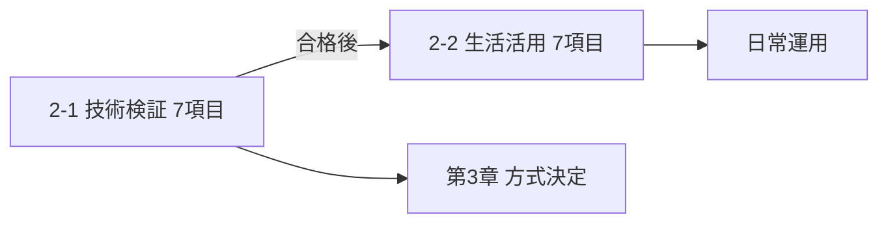

# Hermes Desktop × Docker（WSL2）

## 第1章　概要

### 1-1. 背景

**Hermes Agent**（Nous Research）は、CLI・TUI・Web Dashboard に加え、2026年6月頃から **Hermes Desktop**（macOS / Windows / Linux 向け Electron アプリ）が public preview として提供されている。CLI と **同じ config・セッション・スキル** を共有する。

既存メモ（[[20260704_PCのlinux化]]）では、Let's note CF-RZ4 を Linux 化し **Hermes を薄型クライアント**（CLI 中心）として使う方針を整理済み。推論はサーバー PC 上の **LM Studio**（例: `192.168.124.25:1234`）に任せる構成。

今回は **海老名の Windows PC** 側で、**WSL2 上に Docker がある環境**（2026-08-03 確認: Docker 24.x、**WSLg あり**）を前提に、Hermes を **コンテナで試す** 検討を進める。

### 1-2. 目的

1. **Hermes Desktop の GUI を試す** … ターミナルだけでなく、チャット・設定・ツール出力を視覚的に触る
2. **Docker で隔離した実行環境** … ホスト PC を汚さず、再現性のある sandbox として使う（Hermes の browser ツール等）
3. **既存 LM Studio 構成との接続** … ローカル LLM は引き続きサーバー PC 側。Hermes はエージェント層

### 1-3. 論点（本ドキュメントの焦点）

| 論点 | 内容 |
| --- | --- |
| **GUI は使えるか** | Docker 内で「画面付き」操作ができるか。**本件の最大の論点** |
| **Hermes Desktop 本体か** | 公式 Electron アプリと、Web Dashboard / NoVNC デスクトップは別物 |
| **公式 Docker があるか** | **ない**。コミュニティイメージ or 自前 compose が前提 |
| **WSL2 の利点** | Docker 既存、WSLg で Linux GUI も理論上可、ポートは Windows から `localhost` で触れる |

### 1-4. 環境（2026-08-03 時点）

| 項目 | 内容 |
| --- | --- |
| ホスト OS | Windows（WSL2） |
| WSL | Linux 6.x、`x86_64` |
| Docker | 24.0.7（WSL2 内） |
| WSLg | **あり**（`/mnt/wslg`） |
| LLM（既存） | LM Studio @ `192.168.124.25:1234`（LAN） |
| 関連メモ | [[20260704_PCのlinux化]]（Hermes CLI / Desktop / context 65536 等） |

### 1-5. ドキュメント構成

| 章 | 内容 | 状態 |
| --- | --- | --- |
| **第1章** | 概要 | 執筆済 |
| **第2章** | Hermes でやりたいこと | 執筆済 |
| **第3章** | 方式検討・比較 | 執筆済 |
| **第4章** | 仕組み（アーキテクチャ・通信） | 未執筆 |
| **第5章以降** | 導入手順（採用方式ごとの手順） | 未執筆 |

---

## 第2章　Hermes でやりたいこと

第1章の目的を具体化する。**何のために Hermes を入れるか** を先に並べ、第3章の方式選びの判断材料にする。

### 2-0. 位置づけ

| 区分 | 内容 |
| --- | --- |
| **推論（LLM）** | サーバー PC の **LM Studio** に任せる（Hermes 本体はエージェント層） |
| **実行** | シェル・ファイル・ブラウザ等 — Hermes の **ツール** が動く |
| **記憶** | Obsidian vault 等の **外部記憶** と連携したい |
| **GUI** | ターミナルだけでなく **Dashboard / Desktop** で様子を見たい |

---

### 2-1. 技術的に検証してみたいこと（7）

**「動くか・どう動くか」** を確かめる項目。第3章の方式選び・第5章の手順の **合格基準** になる。

| # | 検証したいこと | 成功の目安 | 関連方式 |
| --- | --- | --- | --- |
| 1 | **WSL2 + Docker で GUI に触れるか** | ブラウザで NoVNC（`:6080`）または Dashboard（`:9119`）が開き、操作できる | A |
| 2 | **LM Studio（LAN）へ接続できるか** | `192.168.124.25:1234` でチャット 1 往復。context **65536+** で 8192 エラーが出ない | A / B / C |
| 3 | **browser ツール（CDP）が動くか** | 指定 URL を開き、ページ内容を取得・要約できる（コンテナ内 Chrome） | A |
| 4 | **Terminal + File ツールが動くか** | `curl`・ファイル作成・編集がエージェント経由で完了する | A / B / C |
| 5 | **Hermes Desktop 本体 vs Dashboard の差** | 操作感・ツール表示・設定 UI を比較し、どちらを日常使いにするか判断できる | A vs B / C |
| 6 | **Docker の隔離・再現性** | `compose down` → `up` 後も設定が volume に残る。ホスト PC への副作用がない | A |
| 7 | **CF-RZ4 展開前の設定を試せるか** | プロバイダ・ツール ON/OFF・LM 設定を海老名 PC で試し、Let's note にそのまま写せる | A / B / C |

---

### 2-2. 生活に役立つこと（7）

**検証が通ったあと、実際に Hermes に任せたいこと。** 介護・外部記憶・自宅 IT が中心。

| # | 生活で役立つこと | 具体例 | 主なツール |
| --- | --- | --- | --- |
| 1 | **介護・制度の調査（情報戦）** | 介護保険サービス、施設種別、ケアマネ相談の流れを調べて要点メモ | browser / web、File |
| 2 | **Obsidian メモの整理・要約** | vault 内の散在メモを要約、索引更新、関連リンクの提案 | File、Memory |
| 3 | **天気・地域情報の取得** | 「海老名の今日の天気」「週末の降水」— Open-Meteo API + terminal | Terminal |
| 4 | **自宅 IT の設定確認** | nest-cast の `config.txt` / cron、ラズパイ SSH 疎通、ログ確認 | Terminal、File |
| 5 | **手続き・期限の事前調査** | 更新期限、必要書類、窓口の空き状況の下調べ（実行は本人） | browser / web |
| 6 | **Web 上の商品・サービス比較** | Wi-Fi 中継、医療機器、送迎サービス等の候補整理 | browser / web、File |
| 7 | **高齢者向け説明の下書き** | 調べた内容を、相手の理解度に合わせた文章に整える（**真実は2つ**を意識） | chat + File |

---

### 2-3. 2つのリストの関係

| 観点 | 2-1 技術検証 | 2-2 生活活用 |
| --- | --- | --- |
| 目的 | **基盤が動くか** | **何に使うか** |
| 時期 | 導入直後〜第5章 | 検証合格後 |
| 失敗時 | 方式変更・設定見直し | ツール OFF・手動に戻す |

**対応の目安**

| 生活 # | 先に通すべき技術検証 # |
| --- | --- |
| 1 介護調査 | 2 LM Studio、3 browser |
| 2 Obsidian | 4 Terminal + File |
| 3 天気 | 2 LM Studio、4 Terminal |
| 4 自宅 IT | 4 Terminal + File、6 Docker 隔離 |
| 5 手続き調査 | 3 browser |
| 6 商品比較 | 3 browser |
| 7 説明下書き | 2 LM Studio、4 File |

---

### 2-4. 優先度の考え方

| 段階 | 技術検証 # | 生活活用 # |
| --- | --- | --- |
| **まず** | 1, 2, 6 | —（基盤優先） |
| **次** | 3, 4, 5 | 3 天気、4 自宅 IT（動作確認が楽しい） |
| **慣れてから** | 7 CF-RZ4 | 1 介護、2 Obsidian、5〜7 |
| **余裕があれば** | Desktop 比較の深掘り | cron 定時調査、Gateway（別途） |

---

### 2-5. 第3章方式選びとの対応（予告）

| 観点 | 方式 A | 方式 B | 方式 C |
| --- | --- | --- | --- |
| GUI 検証（技術 #1, #5） | △ NoVNC / Dashboard | ◎ Desktop | ◎ Desktop |
| LM Studio（#2） | ○ | ○ | ○ |
| browser CDP（#3） | **◎** | ○ | ○ |
| File / Terminal（#4） | ○ | ○ | ◎ |
| Docker 隔離（#6） | **◎** | ○ | ✗ |
| Obsidian 連携（生活 #2） | △ マウント要 | ○ | **◎** |

詳細な比較は **第3章**。

---

## 第3章　方式検討

第1章の目的・**第2章のやりたいこと**を踏まえ、**3 方式**を比較し方針を決める。仕組みの詳細は第4章、作業手順は第5章以降。

### 3-0. 前提の整理

Hermes には **複数の UI** がある。混同しないこと。

| UI | 概要 | GUI の種類 |
| --- | --- | --- |
| **Hermes Desktop** | 公式 Electron アプリ。チャット・設定・ファイルブラウザ等 | **ネイティブ GUI** |
| **Web Dashboard** | `hermes dashboard` / コンテナ内 `:9119` | **ブラウザ GUI** |
| **CLI / TUI** | `hermes chat` / `hermes --tui` | ターミナル |
| **NoVNC デスクトップ** | コンテナ内 XFCE をブラウザ表示 | **リモートデスクトップ GUI** |

**「Hermes Desktop を Docker に入れる」** と言っても、公式に **Desktop 用 Docker イメージは存在しない**。GUI を得る経路を方式ごとに選ぶ必要がある。

---

### 3-1. 方式 A — コンテナ一体型（NoVNC + Dashboard）

**概要:** コミュニティ製 **[neoplanetz/hermes-desktop-docker](https://github.com/Neoplanetz/hermes-agent-desktop-docker)** を WSL2 の Docker で起動。Ubuntu + XFCE + Hermes Agent プリインストール。**ブラウザから Linux デスクトップ**（NoVNC `:6080`）と **Hermes Dashboard**（`:9119`）にアクセスする。

| 観点 | 評価 |
| --- | --- |
| **GUI** | ◎ NoVNC でデスクトップ全体。Dashboard でチャット・設定 |
| **Hermes Desktop 本体** | × README 上は Setup / Dashboard / Terminal ショートカット。Electron Desktop の同梱は明記なし |
| **Docker 隔離** | ◎ エージェント・browser（CDP Chrome）をコンテナ内に閉じられる |
| **セットアップ** | ○ `docker compose up -d` 程度。初回イメージ pull で数 GB |
| **リソース** | △ Chrome CDP + XFCE で **RAM 4GB+** 推奨 |
| **LM Studio 接続** | ○ コンテナから LAN の `:1234` へ（IP / `host.docker.internal` 要確認） |
| **再現性** | ◎ compose + volume で環境を丸ごと再現 |

**向いている用途**

- **まず Docker で Hermes を触る**試験
- **browser ツール**（CDP）を安全に試す — Chrome はコンテナ内 loopback のみ
- GUI は **NoVNC / Dashboard で足りる** 場合

**弱み**

- 公式 Hermes Desktop（Electron）の操作感ではない
- ネイティブアプリより **重い・遅い**（VNC 越し）
- コミュニティメンテ。公式サポート外

---

### 3-2. 方式 B — GUI 分割型（ネイティブ Desktop + Docker バックエンド）

**概要:** **GUI は Windows（または WSLg）の Hermes Desktop**。**中身（`hermes serve` バックエンド）だけ Docker** で動かし、Desktop の **Settings → Gateway → Remote gateway** から `http://localhost:9119` 等に接続する。

| 観点 | 評価 |
| --- | --- |
| **GUI** | ◎ **公式 Electron** の操作感 |
| **Hermes Desktop 本体** | ◎ Windows ネイティブ or WSLg 上の Linux ビルド |
| **Docker 隔離** | ○ バックエンド・ツール実行はコンテナ側に寄せられる（構成次第） |
| **セットアップ** | △ Desktop インストール + コンテナ backend + Remote 接続設定 |
| **リソース** | △ Electron（ホスト）+ コンテナ backend の **二重消費** |
| **LM Studio 接続** | ○ backend コンテナから LM Studio へ（Desktop は推論しない） |
| **再現性** | ○ backend 部分は compose 化可能。Desktop はホスト依存 |

**向いている用途**

- **GUI 操作感を最優先**したい
- Desktop のチャット UI・Command Palette・ファイルブラウザをフルに使いたい
- Docker は **エージェント実行の sandbox** として残したい

**弱み**

- 構成が **2 層**（Desktop + backend）でトラブルシュートが増える
- Remote gateway の **認証・ポート** を理解する必要（[Connecting to a remote backend](https://hermes-agent.nousresearch.com/docs/user-guide/desktop#connecting-to-a-remote-backend)）
- 方式 A 単体より **セットアップ工数が多い**

---

### 3-3. 方式 C — WSL ネイティブ（Docker 不使用）

**概要:** WSL2 内に **Hermes CLI + Desktop を直接インストール**（`install.sh --include-desktop` → `hermes desktop`）。**WSLg** で Linux 向け Electron をネイティブ表示。Docker は使わない。

| 観点 | 評価 |
| --- | --- |
| **GUI** | ◎ WSLg 経由の **ネイティブ Electron** |
| **Hermes Desktop 本体** | ◎ 公式インストールパスそのもの |
| **Docker 隔離** | ✗ ホスト WSL 上で直接実行。sandbox 弱い |
| **セットアップ** | △ 初回 `hermes desktop` で **Electron ビルド 10〜30 分** |
| **リソース** | △ Electron + Python + Node。RAM 多め |
| **LM Studio 接続** | ◎ `~/.hermes/config.yaml` で LAN の LM Studio（既存メモと同じ） |
| **再現性** | △ ホスト環境に依存。クリーン再現は手動 |

**向いている用途**

- **Docker より GUI・Desktop 本体を優先**
- WSLg があるので **Linux Desktop アプリをそのまま試す**
- browser ツールをコンテナ隔離する必要が **今はない**

**弱み**

- **本ドキュメントの「Docker で試す」** という目的からは外れる
- CF-RZ4 メモと同様、**4GB 級では厳しい**（海老名 PC の RAM 次第）
- ホストを汚す。アンインストール・更新は自分管理

---

### 3-4. 3 方式の比較表

| 項目 | **A. コンテナ一体型** | **B. GUI 分割型** | **C. WSL ネイティブ** |
| --- | --- | --- | --- |
| Docker を使う | ◎ 中心 | ○ backend のみ | ✗ |
| GUI | NoVNC + Dashboard | **Electron（ホスト）** | **Electron（WSLg）** |
| Hermes Desktop 本体 | × / △ | ◎ | ◎ |
| 隔離・sandbox | ◎ | ○ | ✗ |
| セットアップの簡単さ | **◎** | △ | △ |
| GUI の快適さ | ○ | **◎** | **◎** |
| browser ツール試験 | **◎**（CDP 同梱） | ○ | ○（ホスト Chromium） |
| LM Studio 連携 | ○ | ○ | ○ |
| 公式サポート距離 | コミュニティ img | 公式 Desktop + 自前 backend | **公式そのまま** |

---

### 3-5. 採用しない方式（参考）

| 方式 | 理由 |
| --- | --- |
| **コンテナ内 Electron + X11/WSLg 転送** | 理論上可能だが設定が複雑。NoVNC かホスト Desktop の方が現実的 |
| **CLI のみ（`hermes chat`）** | GUI 論点外。CF-RZ4 向けには有効だが今回の目的とずれる |
| **CF-RZ4 上で Desktop** | 4GB + Electron で OOM リスク大（[[20260704_PCのlinux化#Hermes Desktop（GUI）について]]） |

---

### 3-6. 判断の軸

何を最優先するかで選び方が変わる。

| 最優先 | おすすめ |
| --- | --- |
| **Docker で手軽に GUI 付き試験** | **方式 A** |
| **公式 Desktop の UI・操作感** | **方式 B**（または C） |
| **Docker より Desktop 本体** | **方式 C** |
| **browser 自動化の安全な試験** | **方式 A**（CDP Chrome がコンテナ内 loopback） |

**段階的な進め方（提案）**

1. **方式 A** で `docker compose up` → NoVNC / Dashboard が使えるか確認
2. LM Studio 接続・チャット 1 往復
3. GUI が物足りなければ **方式 B**（Windows Desktop + コンテナ backend）
4. Docker 自体が不要と判明したら **方式 C** を検討

---

### 3-7. 方針まとめ（暫定）

| 項目 | 暫定決定 |
| --- | --- |
| **第一試行** | **方式 A**（neoplanetz/hermes-desktop-docker @ WSL2） |
| **GUI の意味** | 第一試行では **NoVNC + Dashboard** をもって「GUI 可」とする |
| **Hermes Desktop 本体** | 必要になったら **方式 B** へ |
| **LLM** | 引き続き **LM Studio**（リモート推論）。context **65536+** 必須 |
| **セキュリティ** | ポートは **127.0.0.1 のみ**。デフォルトパスワード変更 |
| **次の章** | 第4章で通信・コンポーネントの仕組み、第5章以降で方式 A の手順 |

---

## 第4章　仕組み

（未執筆 — アーキテクチャ、ポート、Hermes Desktop / serve / Dashboard の関係、LM Studio との通信）

---

## 第5章以降　導入手順

（未執筆 — 第3章で採用した方式ごとのセットアップ・動作確認・トラブルシュート）

---

## 参考リンク

- [Hermes Desktop 公式](https://hermes-agent.nousresearch.com/docs/user-guide/desktop)
- [neoplanetz/hermes-agent-desktop-docker](https://github.com/Neoplanetz/hermes-agent-desktop-docker)
- [[20260704_PCのlinux化]]（Hermes CLI / LM Studio / context 長）
