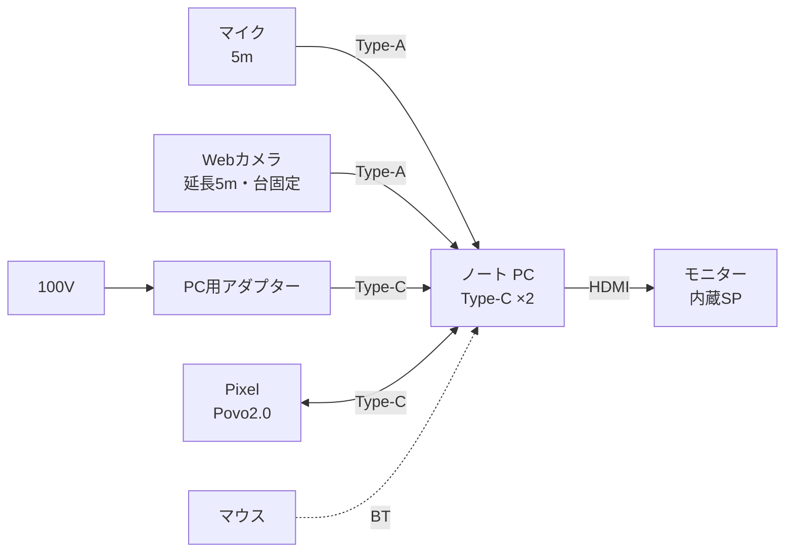
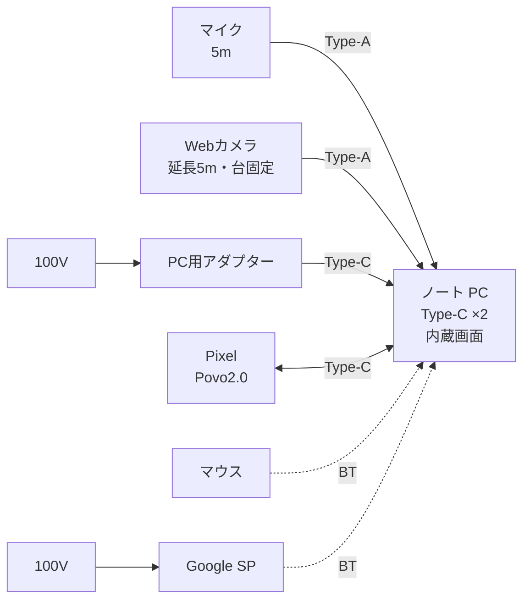

# 細井研 PC 配線図

最終更新: 2026-06-27

## 1. 概要

細井研で使っている PC 周辺機器の接続関係。USB は Type-A / Type-C を区別してメモ。ノート PC の Type-C は **2口**（給電・Pixel テザリングなどに使用）。

### プランの選び方

| | プラン A | プラン B |
|---|---------|---------|
| 画面 | モニター（HDMI） | PC 内蔵画面のみ |
| 音声 | モニター内蔵スピーカー | Google スピーカー（Bluetooth） |
| 条件 | モニター接続可 | モニター接続不可の想定 |

## 2. 配線図

### プラン A

※ HDMI でカラオケ店モニターに接続。音声はモニター内蔵スピーカーから出力。Pixel は USB テザリング（Povo2.0 回線）。

### プラン B

※ HDMI 接続不可の想定。モニターは使わず、Google スピーカーを Bluetooth で接続。

## 3. 運用

### スケジュール（6/26）

| イベント | 内容 |
|---------|------|
| **マウス充電** | Bluetooth マウスの電池を充電 or 交換 |
| **荷造り** | **5. 備考** 持ち物リスト・**撤退チェックリスト**に沿って準備 |

### スケジュール（6/27）

| 時刻 | イベント | 内容 |
|------|---------|------|
| **8:00 頃** | **Povo2.0 契約** | データ使い放題（24時間）を povo2.0 アプリで購入。購入と同時に24時間カウント開始 |
| **8:00 頃** | **持ち物チェックリスト作成** | **5. 備考** 持ち物リストを手書きでチェックリストに書き写し。用紙を持参 |
| **18:00** | **セットアップ** | 起動 → プラン別設定 |
| **18:10** | **初期確認** | 画面・音声・カメラ・マイク・**Pixel テザリング**の動作確認。**音声をテキストに変える設定**も忘れずに |
| **18:30-20:30** | **運用** | 本番作業（約2時間） |
| **20:30-20:40** | **後片付け** | シャットダウン・ケーブル片付け |

### 起動（18:00 セットアップ）

| 順 | 作業 | 備考 |
|----|------|------|
| 1 | PC 用アダプターをコンセントに接続し、PC に Type-C 給電 | |
| 2 | マイク・Web カメラ（延長ケーブル経由）を PC に接続 | ケーブルは**養生テープ**で床・机に固定 |
| 3 | モニターの電源 ON → HDMI 入力を確認 | プラン A |
| 4 | Google スピーカーの電源 ON → PC と Bluetooth ペアリング | プラン B |

### プラン別設定（18:00 セットアップ）

| 項目 | プラン A | プラン B |
|------|---------|---------|
| 画面出力 | モニター（HDMI）を拡張 or 複製 | 内蔵画面のみ |
| 音声出力 | モニター内蔵スピーカー | Google スピーカー（Bluetooth） |
| 確認 | 設定で出力先がモニターになっているか | 設定で Bluetooth スピーカーが選択されているか |

### 初期確認（18:10）

| 項目 | 確認内容 | 備考 |
|------|---------|------|
| 画面 | 表示される、解像度・配置が問題ない | プラン A はモニター、B は内蔵画面 |
| 音声 | テスト音が聞こえる | プラン A はモニター、B は Google スピーカー |
| カメラ | プレビューに映る、画角・台固定 OK | Web カメラ・延長ケーブル経由 |
| マイク | 入力レベルが反応する | ダメなら Web カメラ内蔵マイクへ切り替え |
| 音声テキスト化 | **音声をテキストに変換する設定**を有効化し、話した内容が文字になるか確認 | 初期確認で必ず実施。忘れやすい |
| Pixel テザリング | PC から Pixel 経由で通信できる | 通常は USB テザリング |

### 運用（18:30-20:30）

| 項目 | 内容 |
|------|------|
| 作業 | PC で本番作業（細井研） |
| Pixel | USB テザリング（Povo2.0）で PC と接続 |
| カメラ・マイク | 接続維持。必要に応じて会議・録画 |
| 画面・音声 | セットアップ時のプラン（A or B）のまま |
| トラブル | **4. こんな時には** を参照 |

### Pixel

| 状況 | 作業 |
|------|------|
| 作業中 | **USB テザリング**で PC と接続（Povo2.0 回線） |
| テザリング開始 | Pixel で USB テザリング ON → PC に Type-C 接続 |
| 抜くとき | PC 側で「安全な取り外し」を実行してからケーブルを抜く |

### カメラ・マイク（運用メモ）

| 項目 | 内容 |
|------|------|
| カメラ | 持参の Web カメラを台固定のまま利用（延長ケーブルは抜かない） |
| マイク | 通常は USB マイク。不調時は Web カメラ内蔵マイクに切り替え |
| 会議・録画前 | 18:10 初期確認でデバイスを再確認 |

### 後片付け（20:30-20:40）

| 順 | 作業 | 備考 |
|----|------|------|
| 1 | PC をシャットダウン | |
| 2 | アダプターをコンセントから抜く | |
| 3 | Google スピーカーの電源 OFF | プラン B のみ |
| 4 | Pixel のケーブルを外す | 「安全な取り外し」のあと |
| 5 | **撤退チェックリスト**を上から順に確認 | **5. 備考** 参照。ケーブル類は特に忘れやすい。**養生テープ**は剥がして持ち帰る |

## 4. こんな時には

トラブル対応も含め、よくある質問と回答。

| 質問 | 回答 |
|------|------|
| 画面が出ない（プラン A） | HDMI ケーブルの接続、モニター入力切替を確認。直らなければ **プラン B** に切り替え |
| モニターに HDMI がない | **Type-C 延長ケーブル（バックアップ）**で PC → モニターに接続。給電とモニターで Type-C 2口を使うため、Pixel のテザリングを **USB から Wi-Fi** に切り替え（Pixel で Wi-Fi テザリング ON → PC が Povo2.0 回線の Wi-Fi に接続）。Pixel は PC と USB 接続しないため、**バックアップの Pixel 用アダプター＋Type-C ケーブル**で給電 |
| Povo2.0（Pixel テザリング）が接続できない | 次の順で PC をインターネットに接続する。**①自分の OCN**（Pixel の副回線） **②友人のスマホテザリング** **③カラオケ店の Wi-Fi**（電波が弱いため最後の手段） |
| プラン A と B、どちらを選べばいい？ | HDMI でモニターに映れば **プラン A**（画面＋モニター内蔵 SP）。映らなければ **プラン B**（内蔵画面＋ Google スピーカー） |
| 音が出ない（プラン A） | OS の音声出力先が**モニター**になっているか確認。モニターの音量・ミュートも確認。直らなければ **イヤホン・マイク（3.5mm）**で出力先を切り替えて確認 |
| 音が出ない（プラン B） | Google スピーカーの電源、Bluetooth 接続、OS の出力先を確認。スピーカー側の音量も確認。直らなければ **イヤホン・マイク**で確認 |
| カメラが映らない・認識されない | Web カメラの延長ケーブルと USB 接続を確認。カメラは**台から外さない**。他アプリがカメラを占有していないか確認し、必要ならアプリを再起動 |
| マイクが拾わない | USB 接続を確認。OS の入力デバイスが正しいマイクか確認。直らなければ **Web カメラ内蔵マイク**に切り替え（設定 → サウンド → 入力） |
| 運用中（18:30-20:30）に接続が切れた | いったん作業を止め、該当機器のケーブル or Bluetooth を再接続。上記の症状別 Q&A を参照。復旧後にカメラ・マイクを再確認 |

## 5. 備考

### 持ち物リスト

配線図（**2.**）を参考。**モニター**はカラオケ店常設（持参しない）。

#### PC・マウスセット

| 品目 | 備考 |
|------|------|
| ノート PC | 細井研で使用（Type-C ×2） |
| マウス | PC（Bluetooth） |
| PC 用アダプター（Type-C 給電） | コンセント → PC 給電 |
| 電源タップ（4口） | コンセント → アダプター・モニター・Google SP |
| USB Type-C ケーブル | アダプター → PC |
| USB Type-C ケーブル | Pixel ↔ PC |
| Pixel | USB テザリング → PC（Povo2.0） |
| Web カメラ | 台に固定して PC に接続 |
| マイク（5m ケーブル付） | マイク → PC |
| USB Type-A 延長ケーブル（5m ケーブル） | Web カメラ → PC |
| カメラ台 | Web カメラを固定 |
| HDMI ケーブル（5m ケーブル） | PC → モニター（プラン A・HDMI 入力時） |

#### バックアップ用

| 品目 | 備考 |
|------|------|
| USB Type-C 延長ケーブル | PC → モニター（Type-C のみ・HDMI がない時） |
| Pixel 用アダプター（USB 給電） | モニターが Type-C の時など、Pixel を PC から切り離して給電 |
| USB Type-C ケーブル | Pixel 給電用（上記アダプター → Pixel） |
| Google スピーカー | PC（Bluetooth）・プラン B。100V 給電 |
| イヤホン・マイク（3.5mm） | PC 音声確認・スピーカー不調時（Type-C 口を使わない） |
| イヤホン・マイク（Type-C） | 同上・予備（PC または Pixel） |
| Type-C 二股アダプター | 給電しながら Type-C イヤホンで音声を聞く場合（PC の Type-C 口が足りない時） |

#### その他

| 品目 | 備考 |
|------|------|
| 養生テープ | ケーブルを床・机に固定（引っ越し・養生用。糊残りが少ない） |
| 持ち物チェックリスト（手書き） | 8:00 に **5. 備考** 持ち物リストから書き写し。出発前・現地で確認 |
| この資料（スマホ or 印刷） | **2. 配線図**・**4. こんな時には**・**撤退チェックリスト** 参照用 |

### 撤退チェックリスト

後片付け（20:30-20:40）の最後に、持参したものがすべて戻っているか確認する。**スマホ or 印刷**で持参。

#### PC・マウスセット

- [ ] ノート PC
- [ ] マウス
- [ ] PC 用アダプター（Type-C 給電）
- [ ] 電源タップ（4口）
- [ ] USB Type-C ケーブル（アダプター → PC）
- [ ] USB Type-C ケーブル（Pixel ↔ PC）
- [ ] Pixel
- [ ] Web カメラ
- [ ] マイク（5m ケーブル付）
- [ ] USB Type-A 延長ケーブル（5m ケーブル）
- [ ] カメラ台
- [ ] HDMI ケーブル（5m ケーブル）

#### バックアップ用

- [ ] USB Type-C 延長ケーブル
- [ ] Pixel 用アダプター（USB 給電）
- [ ] USB Type-C ケーブル（Pixel 給電用）
- [ ] Google スピーカー
- [ ] イヤホン・マイク（3.5mm）
- [ ] イヤホン・マイク（Type-C）
- [ ] Type-C 二股アダプター

#### その他

- [ ] 養生テープ
- [ ] 持ち物チェックリスト（手書き）
- [ ] この資料（スマホ or 印刷）
- [ ] 荷物入れ・バッグにすべて収納済み
- [ ] テーブル周り・床にケーブルや小物が残っていない

※ **モニター**はカラオケ店常設（持ち帰らない）。Web カメラ・各ケーブル・台・バックアップ用機器の抜き忘れに注意。

### その他

- 18:10 の初期確認で不具合があれば、**18:30 の運用開始を遅らせる**（本番より事前確認を優先）
- プラン A が使えないときは無理にモニター接続を直そうとせず、**プラン B へ切り替え**て運用を続ける
- カメラは持参の Web カメラを台固定のため、トラブル時も**台から外さず**延長ケーブルと USB 接続を確認する
