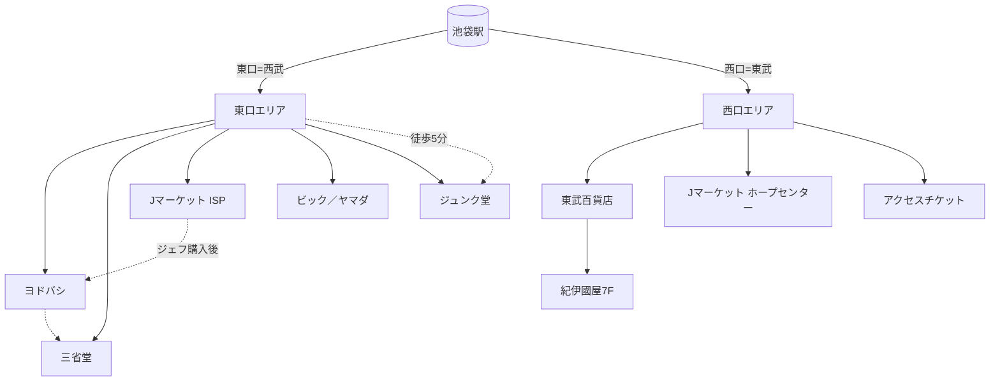

# 池袋駅周辺 見取り図（本屋・家電・金券ショップ）

関連: [[20260811_大塚池袋]]  
※東西の覚え方: **東口＝西武**／**西口＝東武**（名称と方角が逆）

---

## 0. 地図画像（PNG）

![[20260811_池袋見取り図.png]]

| ファイル | 用途 |
| --- | --- |
| [[20260811_池袋見取り図.png]] | オフライン閲覧・印刷用 |
| [インタラクティブ地図（HTML）](20260811_池袋見取り図_map.html) | ブラウザで拡大・タップ可（OpenStreetMap） |
| [[20260811_池袋見取り図.kml]] | Googleマップ／Google Earth にインポートしてピン表示 |

### Googleマップで開く（個別）

| スポット | リンク |
| --- | --- |
| 池袋駅周辺（中心） | [地図を開く](https://www.google.com/maps/@35.7293,139.7120,16z) |
| ヨドバシカメラ | [地図](https://www.google.com/maps/search/?api=1&query=ヨドバシカメラ+マルチメディア池袋) |
| ジュンク堂 池袋本店 | [地図](https://www.google.com/maps/search/?api=1&query=ジュンク堂書店+池袋本店) |
| 三省堂 池袋本店 | [地図](https://www.google.com/maps/search/?api=1&query=三省堂書店+池袋本店) |
| 紀伊國屋（東武） | [地図](https://www.google.com/maps/search/?api=1&query=紀伊國屋書店+池袋店) |
| J・マーケット ISP | [地図](https://www.google.com/maps/search/?api=1&query=Jマーケット+池袋ショッピングパーク) |
| J・マーケット ホープ | [地図](https://www.google.com/maps/search/?api=1&query=Jマーケット+東武ホープセンター) |

**KMLの載せ方（スマホGoogleマップ）:** ファイルをGoogleドライブに上げる → Googleマップアプリ「レイヤ」→「自分のマップ」／PCなら [Googleマイマップ](https://www.google.com/mymaps) で「インポート」→ `20260811_池袋見取り図.kml` を選択。

---

## 1. 全体見取り図（概念図）

北が上。縮尺はおおまか。徒歩分数は駅改札付近からの目安。

```text
                         【北】
                           ↑
        西口側                              東口側
   （東武・メトロポリタン）              （西武・ヨドバシ）
  ┌────────────────┐              ┌────────────────────────┐
  │                  │              │                        │
  │  東武百貨店       │   池袋駅      │  西武池袋本店           │
  │  ┌──────────┐   │  ┌──────┐  │  ┌──────────────────┐ │
  │  │紀伊國屋    │   │  │ JR   │  │  │ヨドバシカメラ      │ │
  │  │池袋店7F   │   │  │・私鉄 │  │  │マルチメディア池袋 │ │
  │  │(〜20:00)  │   │  │・地下鉄│  │  │(9:30〜22:00)     │ │
  │  └──────────┘   │  │      │  │  │＋LINKS IKEBUKURO │ │
  │                  │  │      │  │  │＋三省堂池袋本店   │ │
  │  東武ホープ       │  │中央  │  │  │  (同ビル系・〜21時)│ │
  │  センターB1      │  │通路──┼──┤  └──────────────────┘ │
  │  ★J・マーケット  │  │東西  │  │                        │
  │   (金券・〜21時) │  │接続  │  │  ISP（地下街）          │
  │                  │  │      │  │  ★J・マーケット ISP店  │
  │  ★アクセスチケット│  │      │  │   (金券・東口地下)     │
  │   池袋西口店      │  └──────┘  │                        │
  │                  │              │  ビックカメラ池袋本店    │
  │                  │              │  ヤマダ LABI 池袋       │
  └────────────────┘              │                        │
                                   │     ↓ 徒歩約5分          │
                                   │  ジュンク堂書店 池袋本店 │
                                   │  (南池袋2・〜22:00)      │
                                   │     ↓ さらに南寄り       │
                                   │  （サンシャイン方面）     │
                                   └────────────────────────┘
                           ↓
                         【南】
```

### 今回のおすすめ動線（ジェフ → 家電 → 本屋）

```text
[大塚・朝食後]
    │ 山手線 1駅
    ↓
[池袋・東口]
    │
    ├─① ISP内 ★J・マーケット（ジェフ購入）10:00〜
    │
    ├─② すぐ隣ブロック ヨドバシ＋三省堂
    │
    └─③ 徒歩約5分 ジュンク堂（じっくり本）
```

西口にいるなら: **東武ホープセンターのJ・マーケット** →（地下通路で東へ）→ ヨドバシ／三省堂。

---

## 2. エリア別マップ（東口）

```text
        ＜東口・地上／地下＞

   池袋駅東口 ──直結──► 西武／ヨドバシHDビル
                              │
                              ├─ ヨドバシカメラ（B1〜6F）
                              ├─ LINKS IKEBUKURO
                              └─ 三省堂書店 池袋本店
                                    （別館・書籍館）

   地下街 ISP（池袋ショッピングパーク）
        └─ ★J・マーケット ISP店（ジェフ）

   東口から緑大通り・南池袋方面へ
        ├─ ビックカメラ池袋本店
        ├─ ヤマダデンキ LABI
        ├─ 大黒屋など（金券・買取系）
        └─ 徒歩約5分 → ジュンク堂 池袋本店
                         （ビル丸ごと書店）
```

| スポット | 種別 | 営業（目安） | 駅からの目安 |
| --- | --- | --- | --- |
| ヨドバシカメラ マルチメディア池袋 | 家電 | 9:30–22:00 | 東口直結 |
| 三省堂書店 池袋本店 | 本屋 | 10:00–21:00 | ヨドバシ同ビル |
| J・マーケット ISP店 | 金券 | 月土10–21／日祝10–19:30 | 東口地下・徒歩1–2分 |
| ビックカメラ 池袋本店 | 家電 | （店舗に準ず） | 東口徒歩圏 |
| ヤマダデンキ LABI 池袋 | 家電 | （店舗に準ず） | 東口徒歩圏 |
| ジュンク堂書店 池袋本店 | 本屋 | 10:00–22:00 | 東口徒歩約5分 |

---

## 3. エリア別マップ（西口）

```text
        ＜西口・地上／地下＞

   池袋駅西口 ──直結──► 東武百貨店
                              └─ 7F 紀伊國屋書店 池袋店（〜20:00）

   東武ホープセンター B1
        └─ ★J・マーケット ホープセンター店（ジェフ・〜21:00）

   西口ロータリー周辺
        └─ ★アクセスチケット 池袋西口店（ジェフ）
```

| スポット | 種別 | 営業（目安） | 駅からの目安 |
| --- | --- | --- | --- |
| 紀伊國屋書店 池袋店 | 本屋 | 10:00–20:00 | 東武7F・西口直結 |
| J・マーケット 東武ホープセンター店 | 金券 | 10:00–21:00 | 中央改札〜徒歩1–2分 |
| アクセスチケット 池袋西口店 | 金券 | 目安10:00–19:00（水休情報あり） | 西口徒歩数分 |

---

## 4. 種別インデックス

### 本屋

| 店 | 口 | メモ |
| --- | --- | --- |
| ジュンク堂 池袋本店 | **東** | 最大規模・遅くまで（22時） |
| 三省堂 池袋本店 | **東** | ヨドバシとセット |
| 紀伊國屋 池袋店 | **西** | 東武内・20時まで |

### 家電

| 店 | 口 | メモ |
| --- | --- | --- |
| ヨドバシカメラ マルチメディア池袋 | **東** | 2026/6/30オープン・関東最大級 |
| ビックカメラ 池袋本店 | **東** | 従来からの大型店 |
| ヤマダデンキ LABI 池袋 | **東** | 東口エリア |

### 金券（ジェフ想定）

| 店 | 口 | メモ |
| --- | --- | --- |
| J・マーケット ISP | **東** | ヨドバシ動線向き |
| J・マーケット ホープセンター | **西** | 駅近・21時まで |
| アクセスチケット 西口 | **西** | 水休の可能性→要確認 |

---

## 5. 大塚との位置関係（参考）

```text
  大塚駅 ──山手線 約3分──► 池袋駅
    │
    ├─ 北口: 山下書店(24h)／ロイヤルホスト
    └─ 南口: アトレヴィ旭屋／ホテルベルクラシック（徒歩圏）
```

大塚で朝食 → 池袋東口で金券・ヨドバシ・ジュンク堂、が最短の買い物ルート。

---

## 6. Mermaid（関係図）



---

## 7. 地図リンク（詳細はこちら）

| 目的 | リンク |
| --- | --- |
| ヨドバシ周辺 | [Google Map 南池袋1-28-1](https://maps.google.com/?q=東京都豊島区南池袋1-28-1) |
| ジュンク堂 | [Google Map 南池袋2-15-5](https://maps.google.com/?q=東京都豊島区南池袋2-15-5+ジュンク堂) |
| J・マーケット ISP | [店舗ページ](https://j-market.co.jp/shop_list/ikebukuro_sp) |
| J・マーケット ホープセンター | [店舗ページ](https://j-market.co.jp/shop_list/ikebukuro_tobu) |

営業時間の詳細は [[20260811_大塚池袋]] の各セクションを参照。
