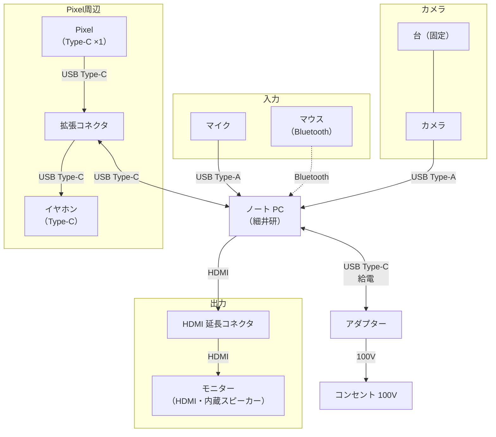
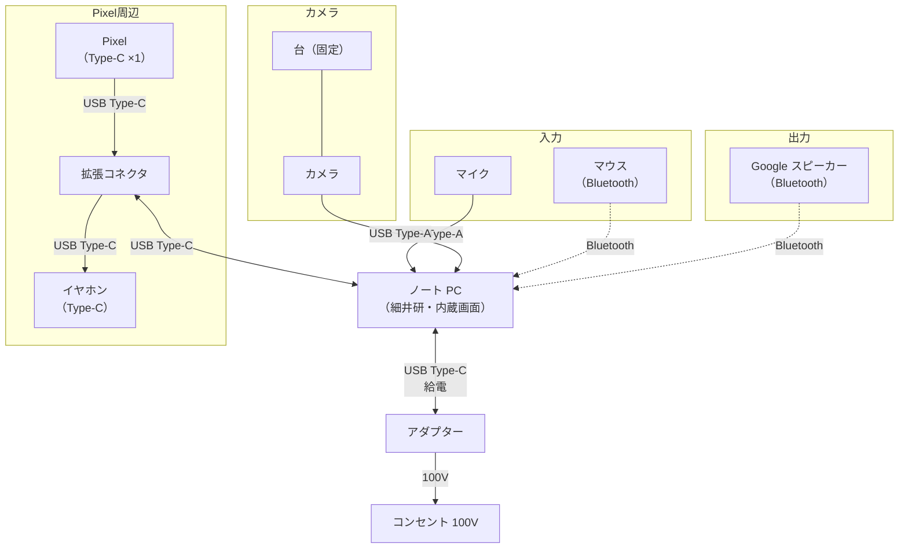

# 細井研 PC 配線図

最終更新: 2026-06-27

## 概要

細井研で使っている PC 周辺機器の接続関係。USB は Type-A / Type-C を区別してメモ。

## 配線図 プラン A

※ HDMI でモニター接続。音声はモニター内蔵スピーカーから出力。

## 配線図 プラン B

※ HDMI 接続不可の想定。モニターは使わず、Google スピーカーを Bluetooth で接続。

